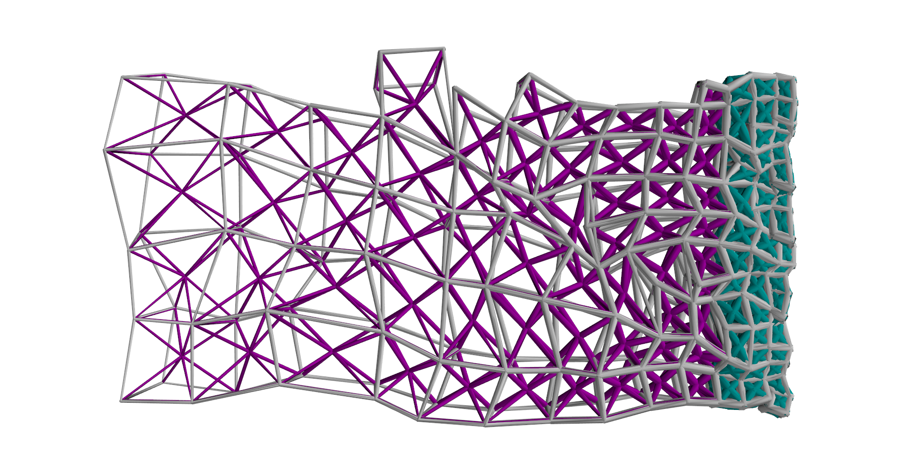

# ME5517 Bone Inner Lattice Generator
Lattice generator and visualiser to generate bio-inspired, non-uniform polycrystalline lattices presented in our group (Group 13) report.

For NUS ME5517 Nature Inspired Materials and Design.

## Scripts
``generator_regular_lattice.ipynb`` Generates regular, ordered lattices \
``generator_stochastic_lattice.ipynb`` Generates non-uniform lattices \

## Running the simulation
1. Install the requirements below in a conda environment
2. In the desired lattice generator Jupyter notebook file, uncomment out the desired lattice structure to be generated and run

# Requirements:
mayavi : 4.8.2\
``$ conda install mayavi``

numpy : 2.2.5\
``$ conda install numpy``

Tested on Windows 10, Python 3.08